# Projet Examen Système de régularisation des impôts (API REST)
Examen de Java Master 1, système de régularisation des impôts pour les contribuables 
# Structure du projet (Packages)
La structure du projet est comme suit:

#### `com.isi.config` : 
est le package qui contient la configuration de l'application à savoir les messages sources et l'encodage des caractères en UTF-8
#### `com.isi.controllers` : 
est le package qui contient les rest API controllers 
#### `com.isi.entities` : 
est le package qui contient les entités JPA qui correspondront aux différents tables qui seront créées au niveau de la base de données:
1. Declarant
2. Declaration
3. Paiement
#### `com.isi.dto` : 
est le package qui contient les DTO (Data Transfert Object) correspondant à nos différentes entités, cela nous permet de faire des validations et nous évite de manipuler directement nos entités
#### `com.isi.repositories` : 
est le package qui contient les interfaces d'accès à la base de données qui héritent de l'interface JPA pour les operations de crud et autres réquêtes 
#### `com.isi.exception` : 
est le package qui nous permet de gérer nos exceptions
#### `com.isi.mapping` : 
est le package qui contient les classes de mapping, les classes de transformation DTO en Entités et Entité en DTO
#### `com.isi.service` : 
est le package qui contient le métier, disons les traitements spécifiques ou les opérations CRUD

## Fonctionnalités
- Enregistrement d'un déclarant avec ses informations de base (Raison sociale, adresse, email, téléphone).
- Création d'une déclaration associée à un déclarant, avec un montant de déclaration.
- Ajout de paiements pour une déclaration spécifique, en vérifiant que le montant total des paiements ne dépasse pas le montant de la déclaration.
- Affichage de la liste des déclarants, des déclarations et des paiements effectués.

## Les captures d'écrans (test avec Postman)
### `DECLARANT`:
- Ajout déclarant
  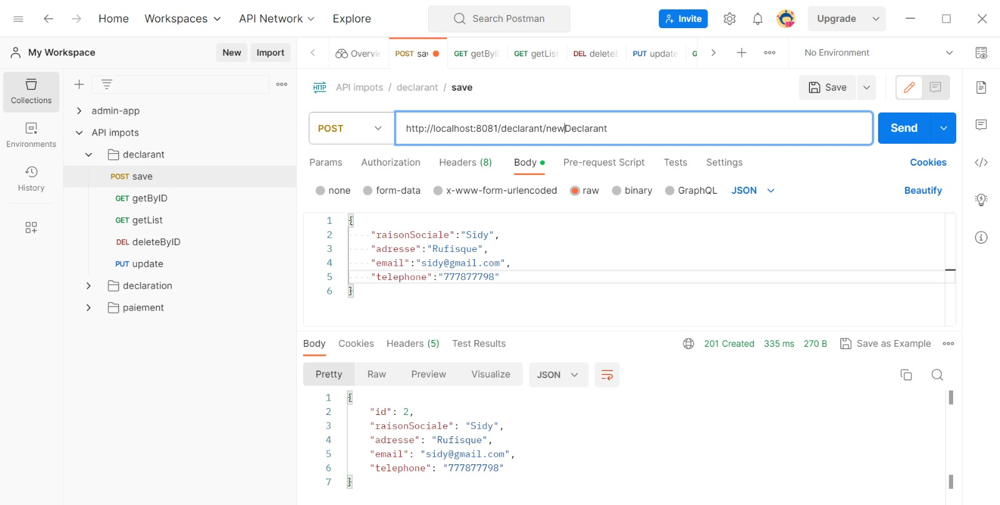
- Récuperation d'un déclarant
  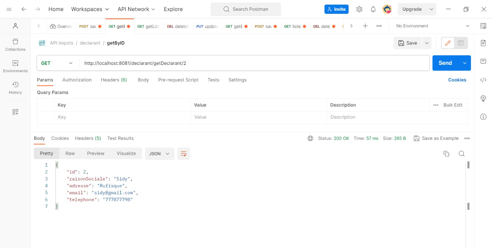
- Récuperation d'un déclarant avec un id qui n'existe pas pour simuler une **erreur**
  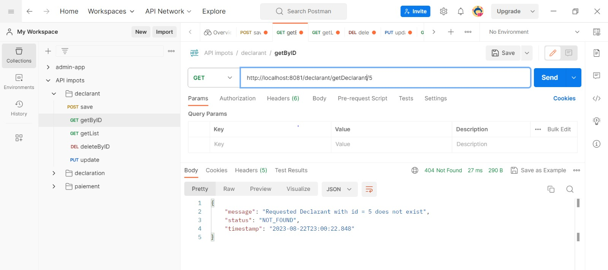
- Liste déclarants
  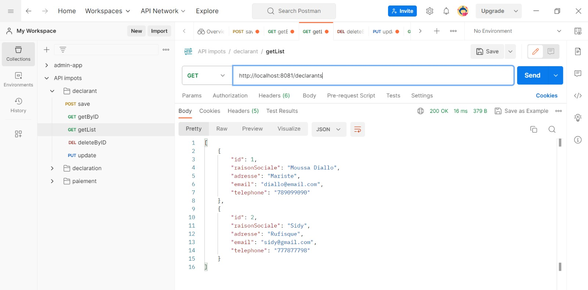
### `DECLARATION`:
- Ajout d'une déclaration
  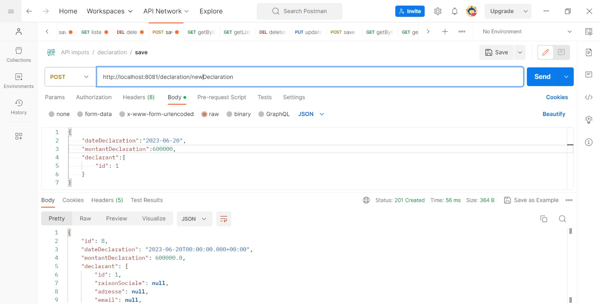
- Récuperation d'une déclaration
  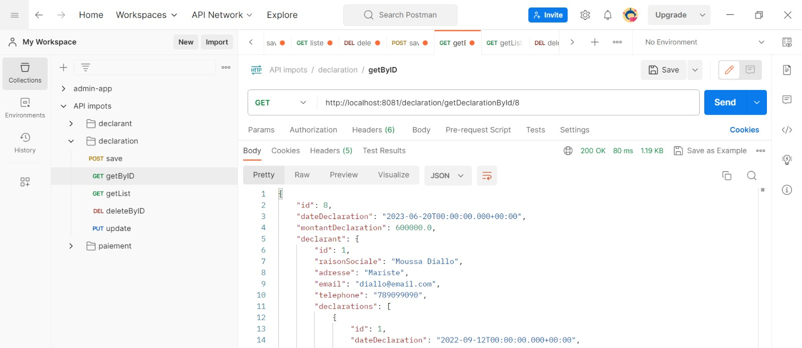
- Récuperation d'une déclaration avec un id qui n'existe pas pour simuler une **erreur**
  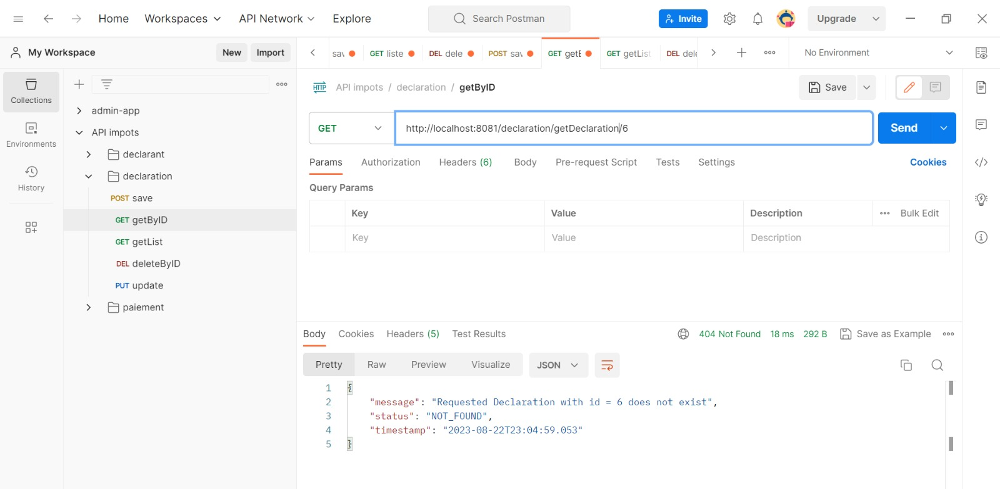
- Liste déclarations
  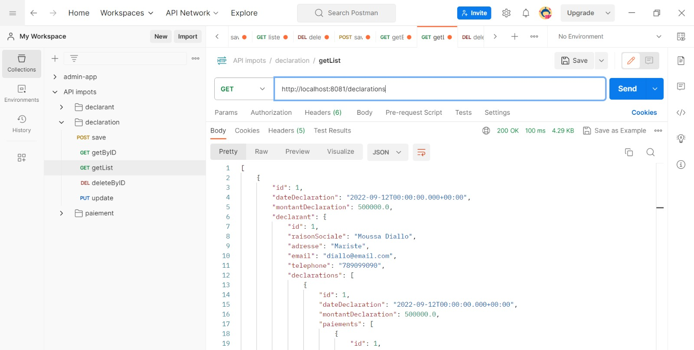

### `PAIEMENT`:
- Ajout d'un paiement d'une déclaration qui dépasse le montant de la déclaration (**Simulation erreur**)  : la déclaration 600 000 et on essaye de payer 800 000
  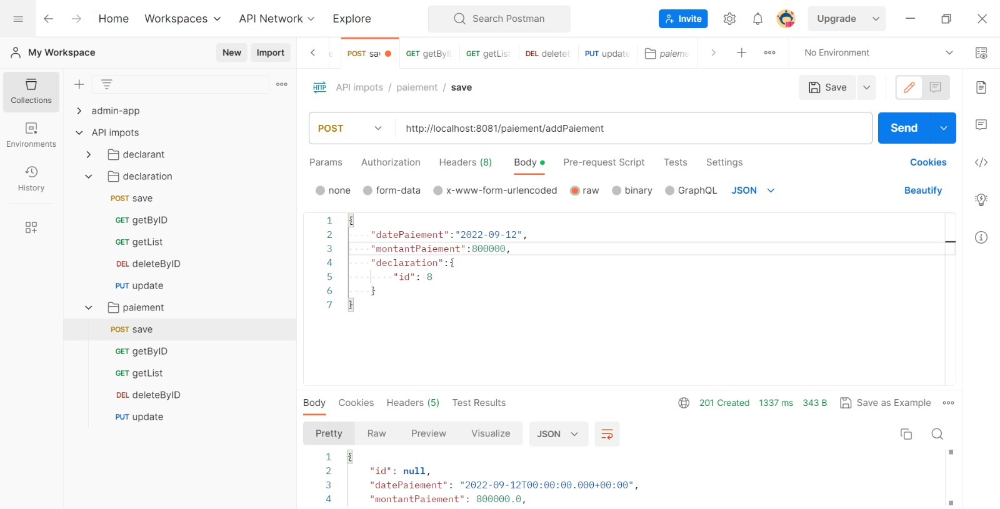
  
- Paiement de 500 000 sur la déclaration 8 dont le montant est 600 000
  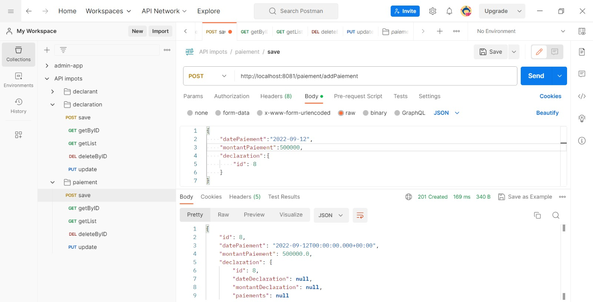
- Récupération du paiement
  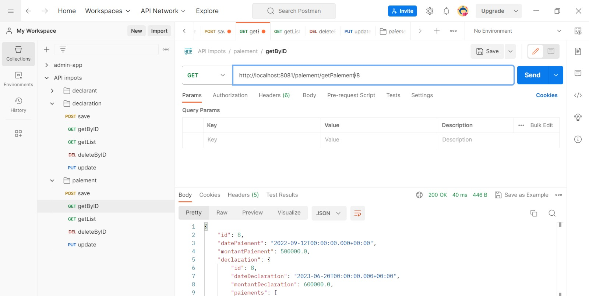
- Liste des paiements
  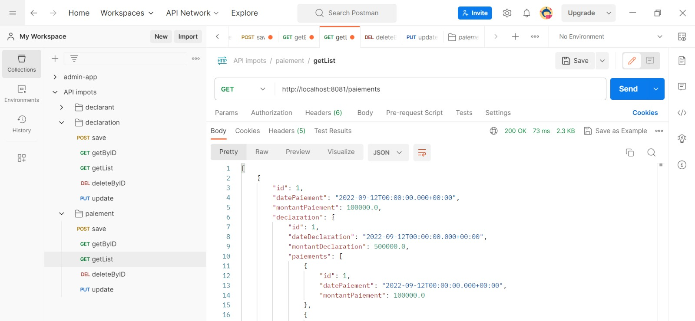

**POUR PLUS D'INFORMATION, NOUS VOUS DEMANDONS DE PARCOURIR LE CODE SOURCE !!!**
